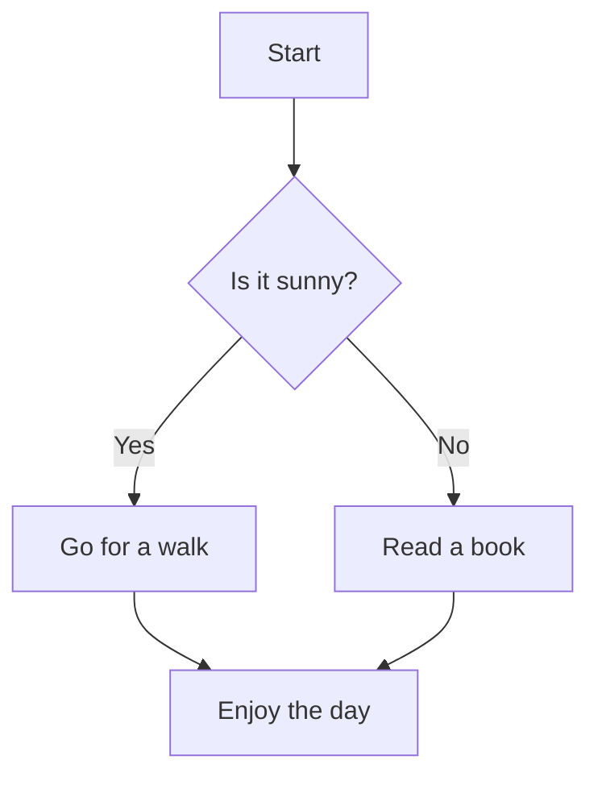
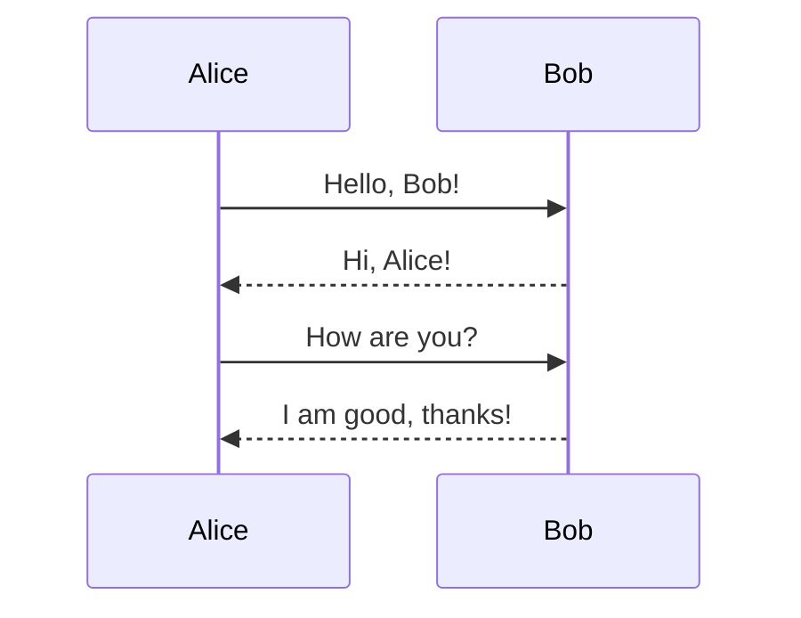
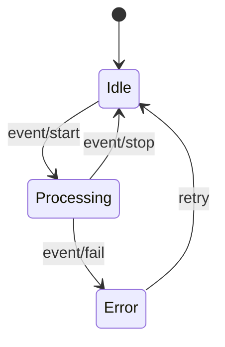
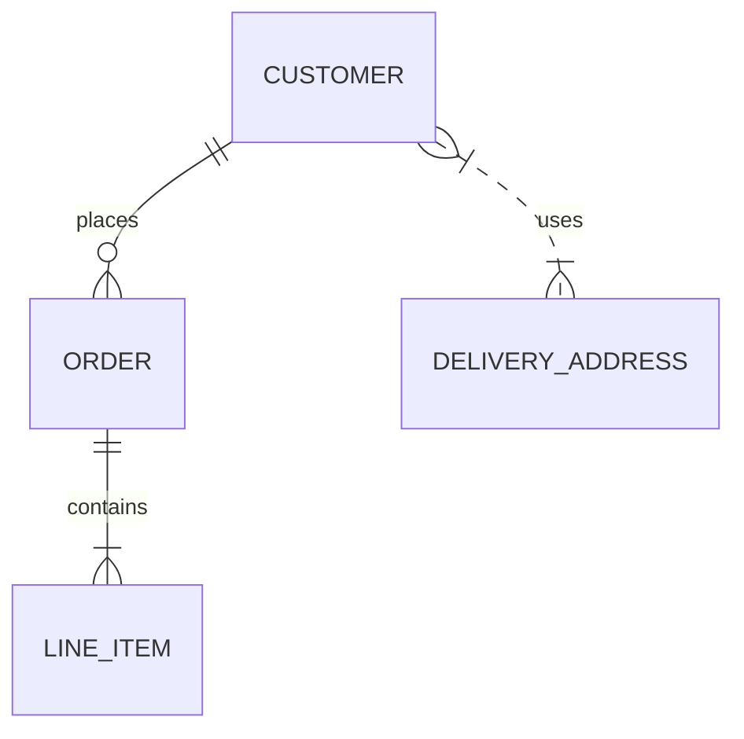
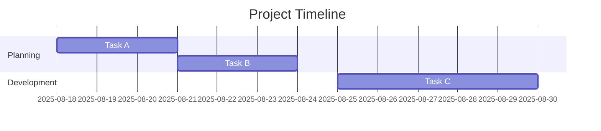
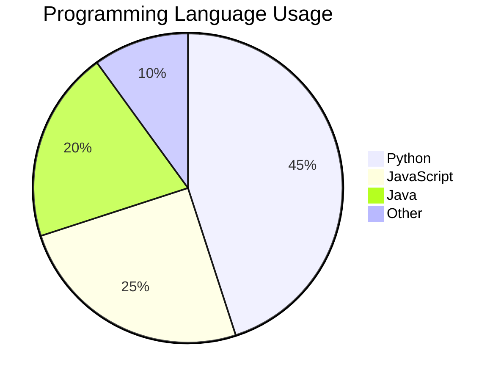

Below are short Mermaid demos for each diagram class you mentioned. Each code block can be rendered by tools or platforms that support Mermaid.

***

### 1. Flowchart

***

### 2. Sequence Diagram

***

### 3. State Diagram

***

### 4. Entity-Relationship Diagram

***

### 5. Gantt Chart

***

### 6. Pie Chart

***

Copy any of these blocks into a Mermaid-compatible environment to see them rendered as diagrams!

Sources
